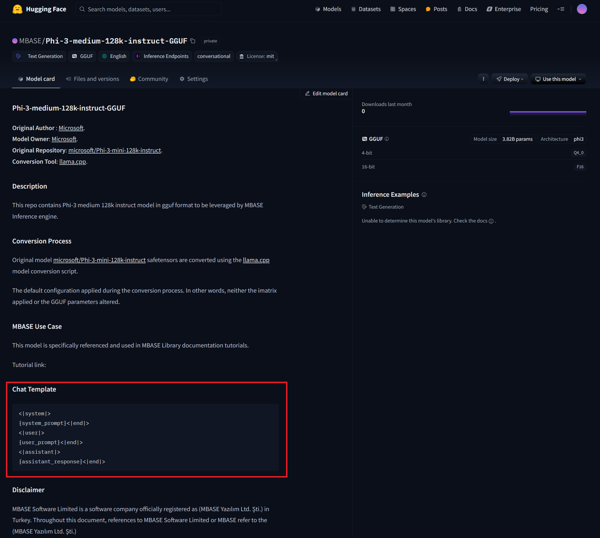

===================
Message Preparation
===================

.. _recall-chat-example:

.. tip::

    You can observe the chat template of the model by reading the :code:`tokenizer.chat_template` key
    in gguf file. To understand how to read values from gguf file, see: :doc:`gguf-files` 

--------------------
About Chat Templates
--------------------

In order to get meaningful results from LLMs, the tokens should be ordered in some way.
The order of communication or the structure of it, can be regarded as chat template in TextToText LLM context.

This is especially relevant in instruct tuned model where the dialogue seems to be progressing like a
turn based dialogue. In order to understand this, take a look at the dialogue below:

.. code-block::

    User: How are you?
    LLM: Good thanks, how about you?
    User: Great thanks. Write me a hello world in python.
    LLM: print('Hello world')

This kind of dialogue can be represented in Phi models in the form given as:

.. code-block::

    <|user|>
    How are you?<|end|>
    <|assistant|>
    Good thanks, how about you?<|end|>
    <|user|>
    Great thanks. Write me a hello world in python.<|end|>
    <|assistant|>
    print('Hello world')<|end|>

Or when it comes to Llama 3 models, it can be represented in the form given as:

.. code-block::

    <|start_header_id|>user<|end_header_id|>
    How are you?<|eot_id|>
    <|start_header_id|>assistant<|end_header_id|>
    Good thanks, how about you?<|eot_id|>
    <|start_header_id|>user<|end_header_id|>
    Great thanks. Write me a hello world in python.<|eot_id|>
    <|start_header_id|>assistant<|end_header_id|>
    print('Hello world')<|eot_id|>

If you are lucky, the model repository you download your model from will have a section in its
model card showing the chat template of the model you download.

For example, you can see the chat template section in `MBASE/Phi-3-medium-128k-instruct-GGUF <https://huggingface.co/MBASE/Phi-3-medium-128k-instruct-GGUF>`_
repository as follows:

If you don't form your message exactly the way LLM expects, you may get results that are poor in quality
and highly inaccurate.

^^^^^^^^^^^^^^^^^^^^^^^
Sophisticated Templates
^^^^^^^^^^^^^^^^^^^^^^^

Some models have different conversation styles or some support tooling embedded into the chat template structure
and have a more sophisticated chat template than usual. For example, here is the `qwen2 <https://ollama.com/library/qwen2>`_'s chat template that is hosted on
ollama model repository:

.. code-block::

    {{ if .Messages }}
    {{- if or .System .Tools }}<|im_start|>system
    {{ .System }}
    {{- if .Tools }}

    # Tools

    You are provided with function signatures within <tools></tools> XML tags:
    <tools>{{- range .Tools }}
    {"type": "function", "function": {{ .Function }}}{{- end }}
    </tools>

    For each function call, return a json object with function name and arguments within <tool_call></tool_call> XML tags:
    <tool_call>
    {"name": <function-name>, "arguments": <args-json-object>}
    </tool_call>
    {{- end }}<|im_end|>
    {{ end }}
    {{- range $i, $_ := .Messages }}
    {{- $last := eq (len (slice $.Messages $i)) 1 -}}
    {{- if eq .Role "user" }}<|im_start|>user
    {{ .Content }}<|im_end|>
    {{ else if eq .Role "assistant" }}<|im_start|>assistant
    {{ if .Content }}{{ .Content }}
    {{- else if .ToolCalls }}<tool_call>
    {{ range .ToolCalls }}{"name": "{{ .Function.Name }}", "arguments": {{ .Function.Arguments }}}
    {{ end }}</tool_call>
    {{- end }}{{ if not $last }}<|im_end|>
    {{ end }}
    {{- else if eq .Role "tool" }}<|im_start|>tool
    <tool_response>
    {{ .Content }}
    </tool_response><|im_end|>
    {{ end }}
    {{- if and (ne .Role "assistant") $last }}<|im_start|>assistant
    {{ end }}
    {{- end }}
    {{- else }}
    {{- if .System }}<|im_start|>system
    {{ .System }}<|im_end|>
    {{ end }}{{ if .Prompt }}<|im_start|>user
    {{ .Prompt }}<|im_end|>
    {{ end }}<|im_start|>assistant
    {{ end }}{{ .Response }}{{ if .Response }}<|im_end|>{{ end }}

Those kinds of templates is resolved and parsed using the `jinja <https://palletsprojects.com/projects/jinja/>`_ parser 
since python community loves jinja so much for some reason and the LLMs are used mostly by python communities.
When you exclude the tool calls, you basically can have a dialogue with qwen2 using this template:

.. code-block:: 

    <|im_start|>system
    {system_prompt}<|im_end|>
    <|im_start|>user
    {user_prompt}<|im_end|>
    <|im_start|>assistant
    {assistant_response}<|im_end|>

Fortunately, the MBASE internally detects the chat template when you initialize the model so that you won't need
to consider about aligning your input text.

----------------------------------
Tokenization and Input Preperation
----------------------------------

The inference engine can't execute the raw input string. The engine
expects token vector as an input to be executed. For that reason,
you first need to tokenize your input string through processor's tokenization methods.

There are two tokenization methods provided by the :code:`InfProcessorTexToText` object as follows:

.. code-block:: cpp
    :caption: mbase/inference/inf_t2t_processor.h

    ...
    flags tokenize_input(CBYTEBUFFER in_data, size_type in_size, inf_text_token_vector& out_tokens);
    flags tokenize_input(context_line* in_lines, size_type in_count, inf_text_token_vector& out_tokens, bool in_append_assistant_token = true);
    ...

The first receives a raw string and creates a vector of tokens as on output. It doesn't apply
any internal formatting to the string so it is basically what you see is what you get scenario here.
Assuming you have a processor object initialized beforehand, you can invoke the tokenizer as follows:

.. code-block:: cpp
    :caption: pseudo c++

    ...
    mbase::string rawString = "C++ is a";
    mbase::inf_text_token_vector outputTokens; // defined in inf_common.h

    processorObj.tokenize_input(rawString.c_str(), rawString.size(), outputTokens);
    ...

It should be your go to if the model is not an instruct model or doesn't have a distinct chat template or
the chat template is not supported by the inference SDK.

In order to make inference engine do the internal formatting and apply the chat template into your input, you have to
call the second method which requires some further clarification.

^^^^^^^^^^^^^
Context Lines
^^^^^^^^^^^^^

The generic chat templating is basically handled through a simple structure called :code:`context_line`
which is defined in :code:`mbase/inference/inf_context_line.h`:

.. code-block:: cpp
    :caption: mbase/inference/inf_context_line.h

    enum class context_role {
        SYSTEM,
        ASSISTANT,
        USER,
        NONE
    };

    struct context_line {
        context_role mRole = context_role::NONE;
        mbase::string mMessage = "";
        U32 mMessageIndex;
    };

.. important::

    The message index field has no effect in general use case.
    It has a meaning if the :code:`InfClientTextToText`'s messaging API is used.
    
    To get further information:

The way your context lines are ordered determines the direction of the conversation with the LLM.
Recall the :ref:`conversation <recall-chat-example>` we had at the beginning of the document.
Here is the context line vector representation of the :ref:`conversation <recall-chat-example>` we had before:

.. code-block:: cpp

    mbase::vector<mbase::context_line> chatHistory = {
        {mbase::context_role::USER, "How are you?"},
        {mbase::context_role::ASSISTANT, "Good thanks, how about you?."},
        {mbase::context_role::USER, "Great thanks. Write me a hello world in python."},
        {mbase::context_role::ASSISTANT, "print('Hello world')"}
    };

By supplying this into the tokenizer, the inference SDK will internally format your dialogue.
Here is how you do it:

.. code-block:: cpp
    :caption: pseudo c++

    ...
    mbase::vector<mbase::context_line> chatHistory = {
        {mbase::context_role::USER, "How are you?"},
        {mbase::context_role::ASSISTANT, "Good thanks, how about you?."},
        {mbase::context_role::USER, "Great thanks. Write me a hello world in python."},
        {mbase::context_role::ASSISTANT, "print('Hello world')"}
    };
    mbase::inf_text_token_vector outputTokens; // defined in inf_common.h

    processorObj.tokenize_input(chatHistory.data(), chatHistory.size(), outputTokens);
    ...

---------
SDK Usage
---------

Tokenization without internal formatting:

.. code-block:: cpp
    :caption: pseudo c++

    ...
    mbase::string rawString = "C++ is a";
    mbase::inf_text_token_vector outputTokens; // defined in inf_common.h

    processorObj.tokenize_input(rawString.c_str(), rawString.size(), outputTokens);
    ...

Tokenization with internal formatting:

.. code-block:: cpp
    :caption: pseudo c++

    ...
    mbase::vector<mbase::context_line> chatHistory = {
        {mbase::context_role::USER, "How are you?"},
        {mbase::context_role::ASSISTANT, "Good thanks, how about you?."},
        {mbase::context_role::USER, "Great thanks. Write me a hello world in python."},
        {mbase::context_role::ASSISTANT, "print('Hello world')"}
    };
    mbase::inf_text_token_vector outputTokens; // defined in inf_common.h

    processorObj.tokenize_input(chatHistory.data(), chatHistory.size(), outputTokens);
    ...

---------------
Header Synopsis
---------------

^^^^^^^^^^^^
Context line
^^^^^^^^^^^^

.. code-block:: cpp
    :caption: mbase/inference/inf_context_line.h

    #ifndef MBASE_CONTEXT_LINE_H
    #define MBASE_CONTEXT_LINE_H

    #include <mbase/common.h>
    #include <mbase/string.h>

    MBASE_BEGIN

    enum class context_role {
        SYSTEM,
        ASSISTANT,
        USER,
        NONE
    };

    struct context_line {
        context_role mRole = context_role::NONE;
        mbase::string mMessage = "";
        U32 mMessageIndex;
    };

    MBASE_END

    #endif // !MBASE_CONTEXT_LINE_H

^^^^^^^^^^^^^^^^^^^^
Hard-coded Templates
^^^^^^^^^^^^^^^^^^^^

.. code-block:: cpp
    :caption: mbase/inference/inf_chat_templates.h

    #ifndef MBASE_CHAT_TEMPLATES
    #define MBASE_CHAT_TEMPLATES

    #include <mbase/common.h>
    #include <mbase/string.h>

    MBASE_BEGIN

    struct InfTemplateQwen {
        mbase::string systemStart = "<|im_start|>system\n";
        mbase::string assistantStart = "<|im_start|>assistant\n";
        mbase::string userStart = "<|im_start|>user\n";

        mbase::string systemEnd = "<|im_end|>\n";
        mbase::string assistantEnd = "<|im_end|>\n";
        mbase::string userEnd = "<|im_end|>\n";
    };

    struct InfTemplatePhi3 {
        mbase::string systemStart = "<|system|>\n";
        mbase::string assistantStart = "<|assistant|>\n";
        mbase::string userStart = "<|user|>\n";

        mbase::string systemEnd = "<|end|>\n";
        mbase::string assistantEnd = "<|end|>\n";
        mbase::string userEnd = "<|end|>\n";
    };

    struct InfTemplateOrion {
        mbase::string systemStart = "System: </s>\n";
        mbase::string assistantStart = "Assistant: </s>\n";
        mbase::string userStart = "</s>Human:\n";

        mbase::string systemEnd = "</s>\n";
        mbase::string assistantEnd = "</s>\n";
        mbase::string userEnd = "</s>\n";
    };

    struct InfTemplateOpenchat {
        mbase::string systemStart = "<s>GPT4 Correct System: ";
        mbase::string assistantStart = "GPT4 Correct Assistant: ";
        mbase::string userStart = "GPT4 Correct User: ";

        mbase::string systemEnd = "<|end_of_turn|>";
        mbase::string assistantEnd = "<|end_of_turn|>";
        mbase::string userEnd = "<|end_of_turn|>";
    };

    struct InfTemplateMonarch {
        mbase::string systemStart = "<s>system\n";
        mbase::string assistantStart = "<s>assistant\n";
        mbase::string userStart = "<s>user\n";

        mbase::string systemEnd = "</s>\n";
        mbase::string assistantEnd = "</s>\n";
        mbase::string userEnd = "</s>\n";
    };

    struct InfTemplateLlama {
        mbase::string systemStart = "<|start_header_id|>system<|end_header_id|>\n";
        mbase::string assistantStart = "<|start_header_id|>assistant<|end_header_id|>\n";
        mbase::string userStart = "<|start_header_id|>user<|end_header_id|>\n";

        mbase::string systemEnd = "<|eot_id|>\n";
        mbase::string assistantEnd = "<|eot_id|>\n";
        mbase::string userEnd = "<|eot_id|>\n";
    };

    struct InfTemplateDeepseek {
        mbase::string systemStart = "";
        mbase::string assistantStart = "### Response:\n";
        mbase::string userStart = "### Instruction: \n";

        mbase::string systemEnd = "";
        mbase::string assistantEnd = "<|EOT|>\n";
        mbase::string userEnd = "";
    };

    struct InfTemplateCommandR {
        mbase::string systemStart = "<|START_OF_TURN_TOKEN|><|SYSTEM_TOKEN|>";
        mbase::string assistantStart = "<|START_OF_TURN_TOKEN|><|CHATBOT_TOKEN|>";
        mbase::string userStart = "<|START_OF_TURN_TOKEN|><|USER_TOKEN|>";

        mbase::string systemEnd = "<|END_OF_TURN_TOKEN|>";
        mbase::string assistantEnd = "<|END_OF_TURN_TOKEN|>";
        mbase::string userEnd = "<|END_OF_TURN_TOKEN|>";
    };

    struct InfTemplateVicuna {
        mbase::string systemStart = "SYSTEM:";
        mbase::string assistantStart = "ASSISTANT:";
        mbase::string userStart = "USER:";

        mbase::string systemEnd = "";
        mbase::string assistantEnd = "</s>\n";
        mbase::string userEnd = "";
    };

    struct InfTemplateZephyr {
        mbase::string systemStart = "<|system|>\n";
        mbase::string assistantStart = "<|assistant|>\n";
        mbase::string userStart = "<|user|>\n";

        mbase::string systemEnd = "<|endoftext|>\n";
        mbase::string assistantEnd = "<|endoftext|>\n";
        mbase::string userEnd = "<|endoftext|>\n";
    };

    struct InfTemplateGemma2 {
        mbase::string systemStart = "<start_of_turn>system\n";
        mbase::string assistantStart = "<start_of_turn>model\n";
        mbase::string userStart = "<start_of_turn>user\n";

        mbase::string systemEnd = "<end_of_turn>\n";
        mbase::string assistantEnd = "<end_of_turn>\n";
        mbase::string userEnd = "<end_of_turn>\n";
    };

    MBASE_INLINE GENERIC tokenizer_align_instruct_template(const mbase::string& in_template,
        mbase::string& out_system_start,
        mbase::string& out_assistant_start,
        mbase::string& out_user_start,
        mbase::string& out_system_end,
        mbase::string& out_assistant_end,
        mbase::string& out_user_end
    );

    MBASE_INLINE GENERIC tokenizer_align_instruct_template(const mbase::string& in_template,
        mbase::string& out_system_start,
        mbase::string& out_assistant_start,
        mbase::string& out_user_start,
        mbase::string& out_system_end,
        mbase::string& out_assistant_end,
        mbase::string& out_user_end
    );

    MBASE_END

    #endif // !MBASE_CHAT_TEMPLATES