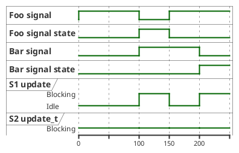

====================================
Signal-driven Parallel State Machine
====================================

**Signal-driven Parallel State Machine** is a method leveraged to solve the problem of execute multiple
jobs in parallel without blocking the main program loop and without worrying about the synchronization of the results
that are produced by the jobs.

Its main difference from the c++'s async api is that, in async api user should know how to work with std::future and should
be well-equiped to program with it. However in **Signal-driven PSM**, user will freely execute expensive jobs and workloads
without changing his/her main application loop, worry about blocking behavior of the methods that are provided by the 
external dependencies, or without extensive knowledge about async and concurrenct programming.

-----
About
-----

**Signal-driven PSM** is a method of running two signal-driven (event-driven) state machines in parallel in which are named as S1, and S2 
where the S1's signals (inputs) are set by S2 and S2's signals (inputs) are set by S1.

S1 = State machine possibly running in the main program loop.

S2 = State machine running in parallel.

The general flow of operation in our case is that the S1, signals the S2 to do some expensive operation. When the operation is done in parallel in S2,
it signals the S1 that the operation is finished so that S1 may call its corresponding callback to notify the user that the operation is finished.
Since the S1 is in sync with its thread and the S1 will possibly be called in the main program loop, synchronization is achieved.

.. grid:: 2
    
    .. grid-item-card::

        .. code-block:: 
            :caption: pseudo S1

            while(...)
            {
                ...
                if(signal_p1)
                {
                    on_p1()
                }
                ...
            }

    .. grid-item-card::

        .. code-block:: 
            :caption: pseudo S2

            while(...)
            {
                ...
                expensive_operation()
                set_signal(p1)
                ...
            }

--------------------------------
Identifying Expensive Operations
--------------------------------

In order to achieve parallelism using **Signal-driven PSM**, we should always start by identifying the expensive operations that needs to be paralleled.
After we have identified the expensive operations, we will implement their signals and in S1, check the signal state to see if the operation is finished and in
S2, check the signal to see if it should execute the expensive operation.

------------
SDK Location
------------

The objects that are related to the **Signal-driven PSM** is defined under the header :code:`/mbase/framework/logical_processing.h`:

.. code-block:: cpp
    :caption: mbase/framework/logical_processing.h

    class MBASE_API processor_signal {
    public:
        processor_signal() noexcept;

        bool get_signal_state() const noexcept;
        bool get_signal() const noexcept;

        GENERIC set_signal_finished() noexcept;
        GENERIC set_signal() noexcept;
        GENERIC set_signal_state() noexcept;
        GENERIC set_signal_with_state() noexcept;
        GENERIC reset_signal() noexcept;
        GENERIC reset_signal_state() noexcept;
        GENERIC reset_signal_with_state() noexcept;

    private:
        ...
    };

    class MBASE_API logical_processor : public mbase::non_copymovable {
    public:
        logical_processor();
        ~logical_processor();

        bool is_processor_running();

        GENERIC start_processor();
        GENERIC stop_processor();
        GENERIC acquire_synchronizer();
        GENERIC release_synchronizer();
        virtual GENERIC update() = 0;
        virtual GENERIC update_t() = 0;
        
    protected:
        ...
    };

^^^^^^^^^^^^^^^^^^^^^^^
Processor Signal Object
^^^^^^^^^^^^^^^^^^^^^^^

Processor signal object is for setting up the signals the acting on them.
The method such as :code:`set_signal` sets the signal for S2 to act on the expensive operation
and the methods such as :code:`set_signal_finished` and :code:`set_signal_state` is achieving the same 
behavior which is signaling the S1, saying that the expensive operation is finished.

The methods such as :code:`get_signal_state` and :code:`get_signal` is for observing the signals.

And the reset methods are unsetting the signal.

^^^^^^^^^^^^^^^^^^^^^^^^
Logical Processor Object
^^^^^^^^^^^^^^^^^^^^^^^^

In order for an object to be a parallel state machine, it needs to inherit from
this object and implement the methods such as :code:`update` and :code:`update_t`.

* :code:`update`: The logic implemented in this method will execute in the calling thread when the user invokes this method. When the document mentions the state machine S1, it refers to the state-machine implementation made in this method. In general, the program should listen on the processor signal states in this method.

* :code:`update_t`: The logic implemented in this method will execute in parallel when the :code:`start_processor` method is called and can optionally be joined into the calling thread by invoking the :code:`stop_processor` method. In general, the program should listen on the processor signals in this method.

------------------
Flow of Operations
------------------

The steps below should be taken in order to do parallel processing with **Signal-driven PSM**:

1. Identify your expensive operations.

2. Initialize your PSM by deriving from the :code:`logical_processor` object if not already initialized.

3. Define signals for your expensive operation.

4. Implement your FSM by listening on signal states in S1, and on signals in S2.

5. Do your expensive operation in S2 and signal the S1 to notify that the operation is done.

---------------
Applied Example
---------------

As an example, we will identify two expensive operations named as **foo** and **bar** where each
one will take at least 500 ms to execute an operation and will execute one after another in parallel.

Let's initialize our PSM first:

.. code-block:: cpp
    :caption: main.cpp

    #include <iostream>
    #include <mbase/framework/logical_processing.h>

    class MyFSM : public mbase::logical_processor {
        public:
            void update() override
            {
                // S1 implementation goes here
            }

            void update_t() override
            {
                // S2 implementation goes here
            }
    };

    int main()
    {
        return 0;
    }

Then implement the **foo** and **bar** operations:

.. code-block:: cpp
    :caption: main.cpp

    #include <iostream>
    #include <mbase/framework/logical_processing.h>

    void foo()
    {
        mbase::sleep(500);
    }

    void bar()
    {
        mbase::sleep(500);
    }

    ...

Then define the processor signals for those operations (you can define them private access indirectly):

.. code-block:: cpp
    :caption: main.cpp

    class MyFSM : public mbase::logical_processor {
        public:
            ..
        mbase::processor_signal mFooSignal;
        mbase::processor_signal mBarSignal;
    };

Let's implement our FSM in :code:`update` and :code:`update_t` methods:

.. code-block:: cpp
    :caption: main.cpp

    void update() override
    {
        printf("State update.\n");
        if(mFooSignal.get_signal_state())
        {
            printf("Foo operation processing signal state\n");
            mBarSignal.set_signal();
            mbase::sleep(500); // Assume it takes 500 milliseconds to process the signal state
            printf("Foo signal state processed\n");
            mFooSignal.reset_signal_state();
            mFooSignal.set_signal();
        }

        if(mBarSignal.get_signal_state())
        {
            printf("Bar operation processing signal state\n");
            mFooSignal.set_signal();
            mbase::sleep(500); // Assume it takes 500 milliseconds to process the signal state
            printf("Bar signal state processed\n");
            mBarSignal.reset_signal_state();
            mBarSignal.set_signal();
        }
        start_processor();
    }

    void update_t() override
    {
        if(mFooSignal.get_signal())
        {
            foo();
            mFooSignal.set_signal_finished();
        }

        if(mBarSignal.get_signal())
        {
            bar();
            mBarSignal.set_signal_finished();
        }
    }

Then in our main, lets instantiate our :code:`MyFSM`, signal operations, start its processor and call its
:code:`update` method with the frequency of 100 iterations per second:

.. code-block:: cpp
    :caption: main.cpp

    int main()
    {
        MyFSM fsm;
        fsm.mFooSignal.set_signal();
        fsm.mBarSignal.set_signal();
        fsm.start_processor();

        while(1)
        {
            fsm.update();
            mbase::sleep(10);
        }

        return 0;
    }

After executing this code, what we expect to see is that the program will continuously display the
text "State update" while the expensive operations such as **foo** and **bar** will be
executed in order in parallel and display their respective texts.

^^^^^^^^^^^^^^
Timing Diagram
^^^^^^^^^^^^^^

Here is the timing diagram below:

