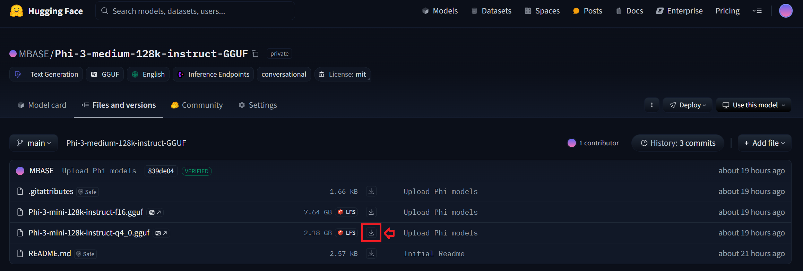

===============
Acquiring Model
===============

.. tip::
    If you already have a valid text-to-text model with GGUF format,
    you can skip this chapter.

In order to do inference, you first need to download an open-source LLM from huggingface or some place anywhere.
The LLM we download should be Text-To-Text since the library supports only that for now.

In our example, we will use the Microsoft's Phi-3-medium-128k-instruct LLM for inference because it is small in general which is suitable for our case.
However, what Text-To-Text model you use won't make a difference for our example, just make sure you have one in your system.

MBASE Inference engine only supports "gguf" file format so that safetensors or any format that is not gguf, must be converted into gguf format.

.. tip::
    Non GGUF models can be converted into GGUF format.
    To see how to do it and in order to have in-depth knowledge of GGUF format, 
    refer to: :ref:`gguf-convert`

------------------------------------
Downloading a Model from Huggingface
------------------------------------

The gguf file of Phi-3-medium-128k-instruct LLM is already being hosted on MBASE Huggingface repository.

Repo link: https://huggingface.co/MBASE/Phi-3-medium-128k-instruct-GGUF

^^^^^^^^^^^^
From Website
^^^^^^^^^^^^

Step 1: Click the "Files and versions" tab:

.. image:: hf_download_step1.png
    :align: center

Step 2: Then download the Q4 quantized version of the model:

^^^^^^^^^^
Using wget
^^^^^^^^^^

Here is a wget command for people who love downloading using terminal:

.. code-block:: bash

    wget https://huggingface.co/MBASE/Phi-3-medium-128k-instruct-GGUF/resolve/main/Phi-3-mini-128k-instruct-q4_0.gguf
